# ShareSplit

> A secure multi-cloud file sharing and recovery system developed collaboratively as a Final Year Project.

## 📌 Overview

ShareSplit is a secure file sharing and recovery system designed to allow users to conveniently store and recover data across multiple cloud storage providers through a single user-friendly interface.

The system is designed to improve data security and resilience by encrypting files and distributing the resulting data and encryption keys across multiple cloud providers.

ShareSplit uses:

- **Reed-Solomon coding** to split and provide redundancy for encrypted file data.
- **Shamir's Secret Sharing** to distribute encryption key shares.
- Cloud provider APIs to perform file upload, download, and deletion operations.

The overall system aims to provide users with secure and resilient multi-cloud file storage without requiring them to interact with each cloud provider individually.

---

## 👥 Team & My Role

ShareSplit was developed collaboratively by a **team of 5** as part of our Final Year Project.

My primary contributions focused on **frontend and backend development**, particularly in authentication, Two-Factor Authentication (2FA), group management, member permissions, and invitation functionality.

### 🔐 Authentication & Security

I implemented and contributed to the following authentication and security functionality:

- Account creation with policy enforcement
- Authenticated user login
- User login with and without Two-Factor Authentication (2FA)
- Administrator login with 2FA
- 2FA enrollment
- Account sign-out functionality

### 👥 Group Management

I implemented functionality for managing user groups, including:

- Group creation
- Group members interface
- Searching for current group members
- Updating member permissions
- Removing/kicking group members
- Closing groups
- Leaving groups
- Retrieving a user's groups
- Group activity logging

### ✉️ Invitation System

I implemented functionality for managing group invitations, including:

- Inviting members to a group
- Accepting invitations
- Rejecting invitations
- Revoking invitations
- Displaying sent invitations
- Displaying received invitations

### 🤝 Collaborative Development

As part of the 5-person development team, I also gained experience with:

- Collaborative software development
- Git and GitHub version control
- Frontend-backend integration
- Working with existing code written by other team members
- Coordinating feature development within a shared codebase

---

## 🛠️ Technology Stack

### Frontend

- React.js

### Backend

- Flask
- Python
- SQLAlchemy

### Database

- PostgreSQL
- Neon

### Development & Deployment

- Docker
- Git
- GitHub
- Windsurf

---

## 🔐 System Security

Security was a major consideration in the overall design of ShareSplit.

The project incorporates:

- User authentication
- Password policy enforcement
- Two-Factor Authentication (2FA)
- Administrator 2FA
- File encryption
- Reed-Solomon coding for data splitting and redundancy
- Shamir's Secret Sharing for encryption key distribution
- API-based interaction with cloud storage providers

My individual security-related contributions focused primarily on **authentication, authorization, and Two-Factor Authentication**.

---

## 📸 Application Screenshots

The following screenshots demonstrate functionality that I contributed to during development.

### Authentication & Account Management

#### Account Creation

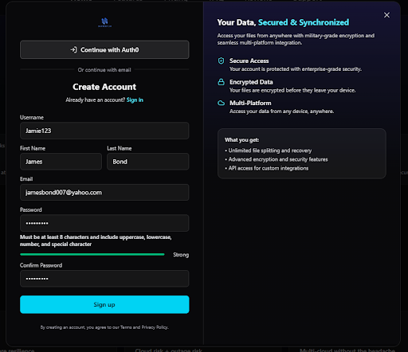

#### Sign In Without 2FA

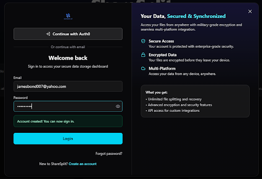

#### 2FA Enrollment

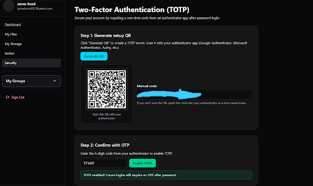

#### Sign In With 2FA

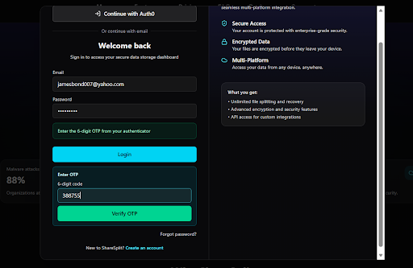

#### Account Sign Out

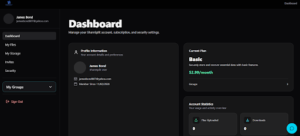

---

### Group Management

#### Creating a Group

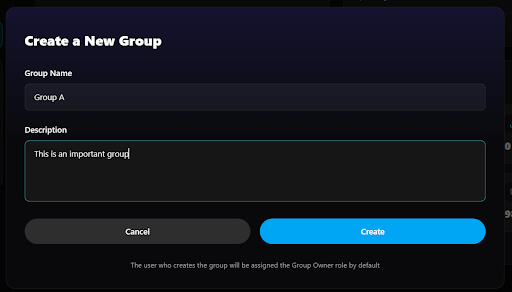

#### Created Group

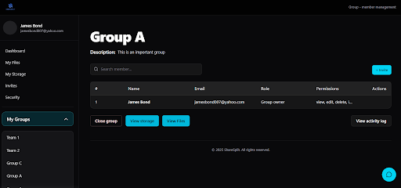

#### Inviting a Group Member

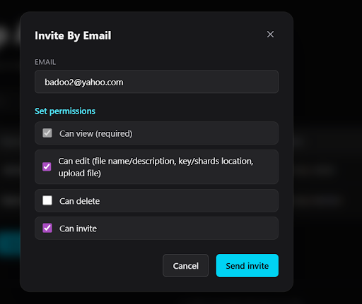

#### Sent Invitation List

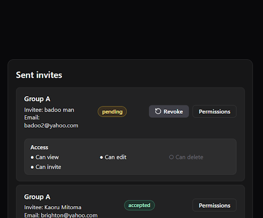

#### Invitations Page

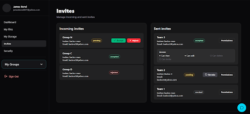

#### Editing Member Permissions

The group owner can access member management actions and select the **Edit Permission** option.

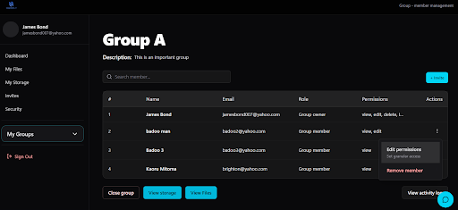

The group owner can then modify the permissions assigned to a group member.

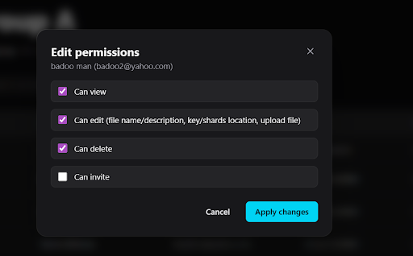

The updated permissions are reflected in the member's account.

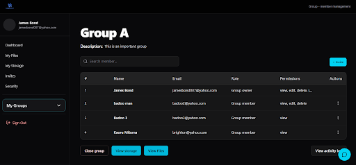

#### Removing a Group Member

The group owner can remove a member from the group.

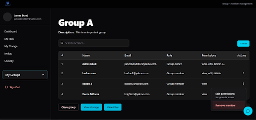

The system reflects the successful removal of the member.

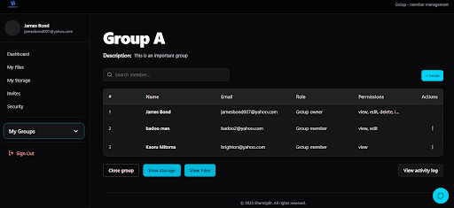

#### Group Activity Log

The group activity log records relevant actions performed within the group.

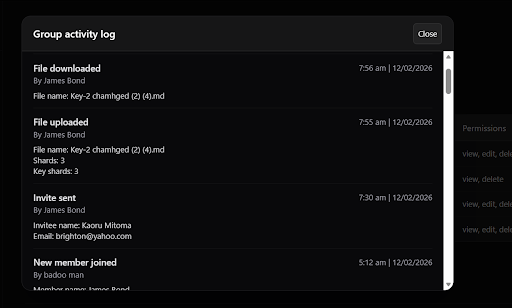

---

## 🏗️ System Architecture

ShareSplit consists of a React.js frontend communicating with a Flask backend, with PostgreSQL used for persistent data storage.

SQLAlchemy is used for database interaction, while Docker was used during development and deployment.

The backend handles encryption, Reed-Solomon coding, Shamir's Secret Sharing, and integration with multiple cloud storage providers.

The system interacts with Google Drive, Dropbox, and AWS through their respective APIs.

---

## 💡 Key Features

### Multi-Cloud Storage

Users can interact with multiple cloud storage providers through a single application interface.

### Secure File Storage

Files are encrypted before being distributed across cloud storage providers.

### Data Recovery

Reed-Solomon coding provides redundancy to support recovery of stored data.

### Secure Key Distribution

Shamir's Secret Sharing is used to split the encryption key into multiple shares.

### User & Group Management

Users can create and manage groups, control member permissions, and monitor group activity.

### Two-Factor Authentication

Users can enroll in and authenticate using Two-Factor Authentication, with additional 2FA protection for administrator accounts.

---

## 🧠 What I Learned

Through this project, I gained practical experience in:

- Full-stack web application development
- React.js frontend development
- Flask backend development
- REST API development
- User authentication and authorization
- Two-Factor Authentication
- Database design and management
- PostgreSQL and SQLAlchemy
- Docker-based development
- Git and GitHub version control
- Collaborative software development
- Integrating frontend and backend functionality
- Developing and managing group-based application functionality

---

## 🔒 Source Code

The original source repository is private because ShareSplit was developed collaboratively as part of a university Final Year Project.

This repository serves as a public portfolio and documentation of the project, showcasing the application's purpose, technologies, functionality, screenshots, and my individual contributions.

The screenshots and documentation provided here are intended to demonstrate the work I contributed to without exposing the complete collaborative source code.

